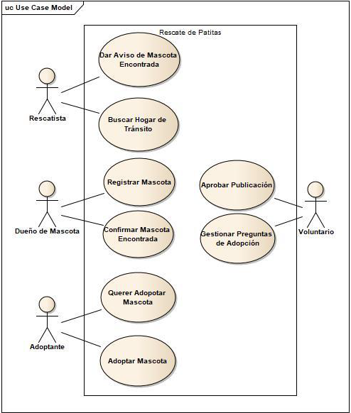

# UTN FRBA - Diseño de Sistemas 2021
## Rescate de patitas - Trabajo Práctico Anual Integrador

[Preview en Heroku](https://patitasalrescate04.herokuapp.com)

### Alumnos:
| Nombre            | GitHub                                         |
| ----------------- | ---------------------------------------------- |
| Soledad Grilletta | [SoleGr](http://github.com/SoleGr)             |
| Nahuel Farias     | [NahuelFarias](http://github.com/NahuelFarias) |
| Pedro Kuljich     | [PedroKuljich](http://github.com/PedroKuljich) |

***

## Descripción
El presente trabajo es una aplicación web SaaS pensada para ser el nexo entre asociaciones rescatistas de animales,
mascotas perdidas o en adopción y dueños de mascotas o posibles adoptantes.
Los dueños de las mascotas las registran, una asociación se encarga de enviarle una chapita con un código QR para
el collar de su mascota. En caso de que alguien encuentre a la mascota, podrá escanear ese código QR y el sistema avisará al
dueño que su mascota fue encontrada.
Un administrador se encarga de dar de alta asociaciones. Estas tienen voluntarios cuyo rol es revisar y aprobar (o rechazar) publicaciones.



***

## Tecnologías utilizadas:
* Java
* MySQL
* HTML
* JavaScript
* CSS
* Hibernate
* Spark Framework
* Bootstrap

***

## Modelo de dominio


***

## Modelo de datos


***
## Instalación
Para correr una copia del proyecto en forma local seguir las siguientes instrucciones.

1. Clonar el repositorio.
 ```
    git clone https://github.com/dds-utn/2021-ma-ma-grupo-04
```

2. Crear una base de datos MySQL.
   
3. En el archivo persistance.xml ubicado en rescateDePatitas/src/main/resources/META-INF/ ingresar el nombre de la base de datos, usuario y contraseña en estas líneas:
 ```xml
    <property name="hibernate.connection.url" value="jdbc:mysql://localhost:3306/NOMBRE_BD" />
    <property name="hibernate.connection.username" value="USUARIO" />
    <property name="hibernate.connection.password" value="CONTRASEÑA" />
```

4. Se puede correr el test "Creación entidades" para ingresar valores iniciales en la base de datos.

